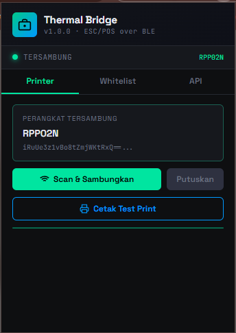
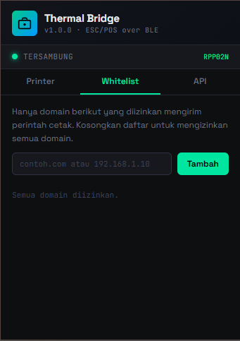
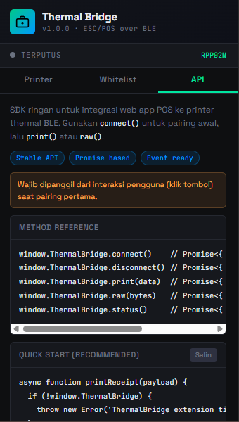

# Thermal Bridge Extension

> Chrome Extension (Manifest V3) — Jembatan Web-to-Bluetooth untuk printer thermal ESC/POS.  
> Silent printing tanpa System Print Dialog, langsung ke perangkat keras via BLE.

---

## Instalasi (Developer Mode)

1. Buka `chrome://extensions` (atau `edge://extensions`).
2. Aktifkan **Developer Mode** (toggle kanan atas).
3. Klik **Load unpacked** → pilih folder `thermal-bridge/`.
4. Ekstensi muncul di toolbar. Klik → Scan & Sambungkan printer.

---

## Preview





---

## Struktur File

```
thermal-bridge/
├── manifest.json                # MV3 config, permissions
├── background/
│   └── service-worker.js        # BLE manager, print queue, whitelist
├── content/
│   └── content-script.js        # Injects window.ThermalBridge API
├── lib/
│   └── escpos-encoder.js        # Pure-JS ESC/POS builder + receipt formatter
├── popup/
│   ├── popup.html               # Extension UI
│   ├── popup.css                # Styling
│   └── popup.js                 # UI logic
└── icons/
    ├── icon16.png
    ├── icon48.png
    └── icon128.png
```

---

## API (window.ThermalBridge)

Setelah ekstensi terpasang, setiap halaman mendapatkan `window.ThermalBridge`.

### `ThermalBridge.print(payload)` → `Promise<Result>`

Mencetak struk dari payload JSON terstruktur.

```js
const result = await window.ThermalBridge.print({
  header: {
    title:      "Nama Toko",          // bold, besar, center
    subtitle:   "Tagline / cabang",   // opsional
    address:    "Jl. ...",            // opsional
    phone:      "021-xxxxx",          // opsional
    receipt_no: "INV-20240601-001",   // opsional
    cashier:    "Nama Kasir",         // opsional
  },
  items: [
    { name: "Nama Produk",  qty: 2, price: 15000 },
    { name: "Produk Lain",  qty: 1, price: 25000 },
  ],
  subtotal: 55000,   // tampil jika beda dari total
  discount: 5000,    // opsional
  tax:       5000,   // opsional (PPN dll)
  total:    55000,   // wajib
  payment: {
    method: "CASH",         // atau "QRIS", "DEBIT", dll
    amount: 100000,         // jumlah dibayar
    change:  45000,         // kembalian
  },
  footer: "Terima kasih sudah berbelanja!",  // opsional
  qr:     "https://toko.com/invoice/001",    // opsional, cetak QR code
  width:  32,   // lebar karakter (32 = 58mm, 42 = 80mm). Default: 32
});

// Result
// { success: true }
// { success: false, message: "Printer tidak terhubung." }
```

### `ThermalBridge.raw(bytes)` → `Promise<Result>`

Kirim byte array ESC/POS mentah. Untuk kontrol penuh.

```js
// Contoh: cetak teks sederhana + cut
const ESC = 0x1B, GS = 0x1D, LF = 0x0A;
const bytes = [
  ESC, 0x40,            // Initialize
  ...Array.from("Hello, Printer!\n").map(c => c.charCodeAt(0)),
  LF, LF, LF,
  GS, 0x56, 0x00,       // Full cut
];
await window.ThermalBridge.raw(bytes);
```

### `ThermalBridge.status()` → `Promise<StatusResult>`

```js
const { status, device } = await window.ThermalBridge.status();
// status: 'connected' | 'disconnected' | 'connecting' | 'error'
// device: { id: string, name: string } | null
```

### Event: `thermalbridge:status`

```js
window.addEventListener('thermalbridge:status', (e) => {
  const { status, device, message } = e.detail;
  console.log('Printer status:', status);
});
```

---

## Whitelist Domain

Untuk keamanan, hanya domain yang terdaftar yang boleh mengirim perintah cetak.

- Buka popup ekstensi → tab **Whitelist**.
- Tambahkan hostname (contoh: `kasir.tokosaya.com` atau `localhost`).
- Daftar kosong = semua domain diizinkan (cocok untuk development).

---

## Arsitektur

```
Web App (halaman)
    │  window.ThermalBridge.print(payload)
    ▼
content-script.js          ← injected ke setiap halaman
    │  window.postMessage relay
    ▼
service-worker.js          ← MV3 background
    │  navigator.bluetooth (Web Bluetooth API)
    ▼
BLE Printer                ← via GATT characteristic write
```

**Print Queue:** Setiap job antri di memory dan diproses secara serial.  
Auto-reconnect: jika koneksi terputus, SW mencoba menyambung ulang ke device terakhir.

---

## Kompatibilitas Printer

Ekstensi mencoba dua profil BLE secara berurutan:

| Profil | Service UUID | Characteristic |
|---|---|---|
| Generic Serial (SPP-LE) | `000018f0-…` | `00002af1-…` |
| Nordic UART (NUS) | `6e400001-…` | `6e400002-…` (TX) |

Kompatibel dengan: Epson TM series, Bixolon SRP, Citizen CT, Sewoo, Xprinter, dan kebanyakan printer thermal BLE.

---

## Tech Stack

- Chrome Extension Manifest V3 + Service Workers
- Web Bluetooth API (`navigator.bluetooth`)
- ESC/POS protocol (custom pure-JS encoder, tanpa dependensi)
- Vanilla JS (zero framework, zero build step)

---

## Pengembangan Lanjutan

- [ ] Support gambar logo (bitmap raster via ESC/POS `GS v 0`)
- [ ] Antarmuka multi-printer (simpan beberapa device)
- [ ] Export/import konfigurasi whitelist
- [ ] Android: test di Kiwi Browser / Mises Browser
